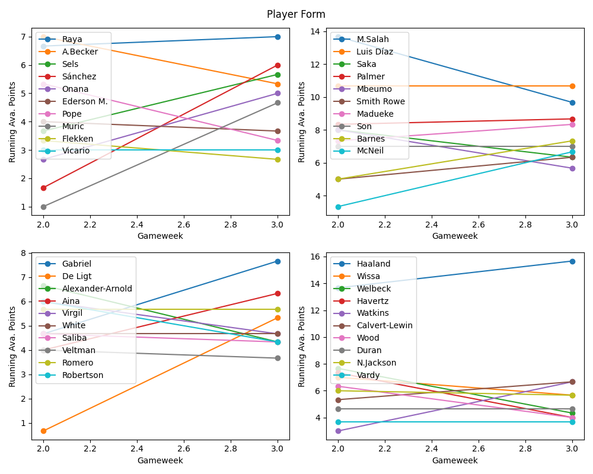

# FPL data & Mini League
An attempt to show few FPL analytics data and mini league stats

# Top players by form


# Fixuture difficulty and Team form
- Fixture difficulty (by next 3,5,10,remaining fixtures)
- Team form (last 5 PPG, last 5 GPG, overall PPG, clean sheets)

# your team stats
```
╒════════╤═══════════════════════╤════════════════╤═══════╤═════════╤═════════╤═════════╤══════════╤══════════╤════════════════╤═════════╕
│   Name │ selected_by_percent   │   total points │   PPG │   xG/90 │   goals │   xA/90 │   asists │   xGi/90 │   clean sheets │   bonus │
╞════════╪═══════════════════════╪════════════════╪═══════╪═════════╪═════════╪═════════╪══════════╪══════════╪════════════════╪═════════╡
```

# Mini league stats including bench points and transfers
```
+----------------------+----------------------+--------------+----------------+-------------------+-----------+--------------+
|         Name         |         Team name       | Total points | Benched Points | Cost of Transfers | Transfers | Entry Number |
+----------------------+----------------------+--------------+----------------+-------------------+-----------+--------------+
```
To get the mini league stats, set your mini league number in run.py file (line#184)

# How to run this repo
- Clone the repo
```
git clone https://github.com/thecloudtechnologist/fpl_info.git
cd fpl_info
```
- create venv and activate it
```
python -m venv .venv
source .venv/bin/activate
```
- Install dependencies/requirements
```
pip install -r requirements.txt
```
- update variables 
update variables in variables.py
- Run the script 
```
python ./Run.py
```